## Exemple : lancement d'une chaîne de 2 nœuds

Dans cet exemple, nous démarrons une chaîne minimale de deux agents qui vont :

1. S’annoncer mutuellement (messages `Announce`).
2. Se découvrir et échanger leurs capacités/recettes.
3. Se surveiller en continu via des messages `Ping` / `Pong`. Les deux nœuds émettent leur propre Ping périodiquement, et l’autre répond par Pong

### 1. Démarrage des deux agents

Lancement du premier agent (nœud A) :
```bash
./pizza_factory start --host 127.0.0.1:8000 --capabilities MakeDough --recipes-file recipes/examples.recipes --debug
```
Lancement du deuxième agent (nœud B), qui se connecte au premier :
```bash
./pizza_factory start --host 127.0.0.1:8002 --capabilities AddBase,AddCheese,AddPepperoni,Bake,AddOliveOil --peer 127.0.0.1:8000 --debug
```

Chaque agent écoute sur un port UDP différent (`8000` et `8002`) et échange des paquets contenant des messages CBOR.

### 2. Observation des paquets dans Wireshark

Voici les en‑têtes des paquets échangés entre les deux agents, vus dans Wireshark, avec la charge utile décodée (la partie JSON est une **vue décodée du CBOR**).


La capture réseau complète utilisée pour cet exemple est disponible dans le dépôt :

- [`starting-peer-annouced.pcap`](./doc/pcap/starting-peer-annouced.pcap)
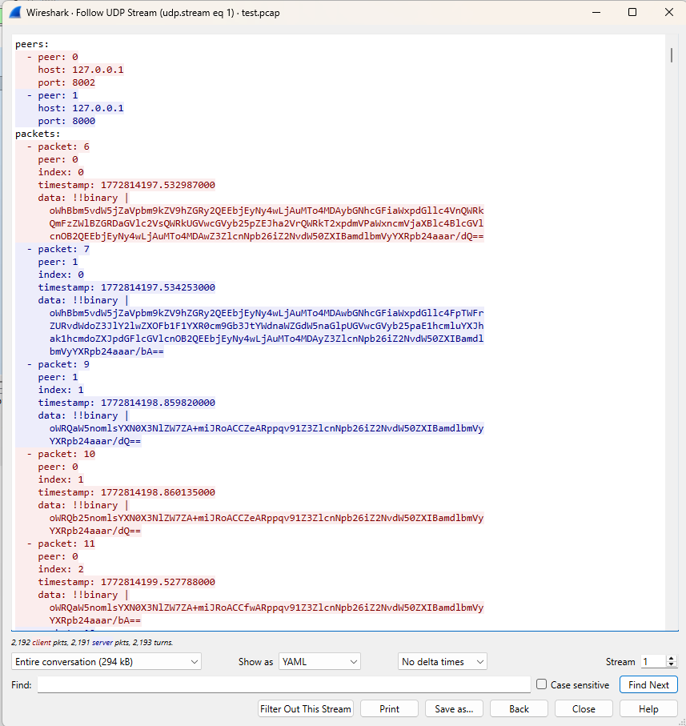
#### Annonce initiale du nœud A vers le nœud B

```bash
3	1.176352	127.0.0.1	127.0.0.1	UDP	201	8002 → 8000 Len=169
```
```json
{
    "Announce": {
        "node_addr": {
            "tag": 260,
            "value": "127.0.0.1:8000"
        },
        "capabilities": [
            "MakeDough"
        ],
        "recipes": [
            "QuattroFormaggi",
            "Pepperoni",
            "Funghi",
            "Margherita",
            "Marinara"
        ],
        "peers": [
            {
                "tag": 260,
                "value": "127.0.0.1:8002"
            }
        ],
        "version": {
            "counter": 3,
            "generation": 1772191739
        }
    }
}
```

Par la suite le premier agent a répondu à l'annonce du deuxième agent en envoyant une annonce à son tour, avec les capacités et les recettes qu'il peut faire, ainsi que les pairs auxquels il est connecté avec un tag

```bash
4	1.176511	127.0.0.1	127.0.0.1	UDP	216	8000 → 8002 Len=184
```
```json
{
    "Announce": {
        "node_addr": {
            "tag": 260,
            "value": "127.0.0.1:8002"
        },
        "capabilities": [
            "AddBase",
            "AddCheese",
            "AddPepperoni",
            "Bake",
            "AddOliveOil"
        ],
        "recipes": [],
        "peers": [
            {
                "tag": 260,
                "value": "127.0.0.1:8000"
            }
        ],
        "version": {
            "counter": 1,
            "generation": 1772192016
        }
    }
}
```

Le deuxième agent a ensuite envoyé un ping au premier agent pour vérifier sa disponibilité, et le premier agent a répondu avec un pong, tous les deux avec un tag
```bash
7	3.177938	127.0.0.1	127.0.0.1	UDP	99	8002 → 8000 Len=67
```
```json
{
    "Ping": {
        "last_seen": {
            "tag": 1001,
      "value": {
        "1": 1776203464,
        "-6": 732948
      }
        },
        "version": {
      "counter": 1,
      "generation": 1776203458
        }
    }
}
```

Le premier agent a ensuite répondu au ping du deuxième agent avec un pong, tous les deux avec un tag
```bash
8	3.178069	127.0.0.1	127.0.0.1	UDP	99	8000 → 8002 Len=67
```
```json
{
    "Pong": {
        "last_seen": {
            "tag": 1001,
      "value": {
        "1": 1776203464,
        "-6": 732948
      }
        },
        "version": {
      "counter": 1,
      "generation": 1776203458
        }
    }
}
```

Et ici les rôles sont inversés, le premier agent a envoyé un ping au deuxième agent pour vérifier sa disponibilité, et le deuxième agent a répondu avec un pong.
```bash
11	4.148875	127.0.0.1	127.0.0.1	UDP	99	8000 → 8002 Len=67
```
```json
{
    "Ping": {
        "last_seen": {
            "tag": 1001,
      "value": {
        "1": 1776203464,
        "-6": 732840
      }
        },
        "version": {
            "counter": 1,
      "generation": 1776203464
        }
    }
}
```

Pareil le deuxième répond et lui renvoie un ping ainsi de suite afin de garantir une disponibilité constante entre les deux agents.
```bash
12	4.149029	127.0.0.1	127.0.0.1	UDP	99	8002 → 8000 Len=67
```
```json
{
    "Pong": {
        "last_seen": {
            "tag": 1001,
      "value": {
        "1": 1776203464,
        "-6": 732840
      }
        },
        "version": {
            "counter": 1,
      "generation": 1776203464
        }
    }
}
```

Dans les traces observees, le `Pong` reprend la valeur `last_seen` du `Ping` correspondant (echo). Le champ `last_seen` transporte une map numerique taggee 1001 dans laquelle :

- `1` represente la composante en secondes Unix.
- `-6` represente la composante fractionnaire (sous-seconde).
#### 2.1 Commande list-recipes
Lancement d'un client, qui se connecte au premier agent :
```bash
./pizza_factory client --peer 127.0.0.1:8000 list-recipes
```
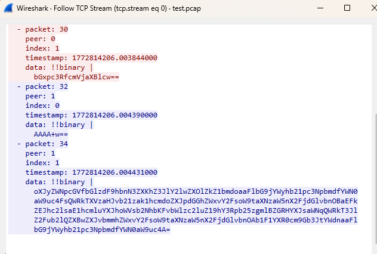

Lorsqu’un client se connecte au service TCP sur le port 8000, le système d’exploitation attribue automatiquement un port éphémère côté client (par exemple 58695).
Ce port identifie la session TCP et permet au serveur de gérer plusieurs connexions simultanées.

- Établissement de la connexion TCP

  - ```json
    25 58695 → 8000  [SYN]

    26 8000  → 58695 [SYN, ACK]

    27 58695 → 8000  [ACK]
    ```
    Il s’agit du handshake TCP classique en trois étapes (three-way handshake), utilisé pour établir une connexion fiable entre deux machines.

    Le client utilise l’adresse 127.0.0.1 avec un port éphémère 58695. Le serveur écoute sur l’adresse 127.0.0.1 au port 8000

- Première commande TCP

  - ```json
    58695 → 8000  [PSH, ACK] Len=4

    data: !!binary |
    AAAADQ==
    ```
    Cela annonce la taille du message suivant : 4 octets.
    Après décodage Base64 : 00 00 00 0D


- Envoi du payload de la commande

  - ```json
      58695 → 8000 [PSH, ACK] Len=13
      data: !!binary |
      bGxpc3RfcmVjaXBlcw==
      ```
    Après décodage CBOR : "list_recipes". Cette chaîne correspond directement à la commande envoyée par le client


- Réponse du serveur sur la taille de la réponse

  - ```json
     8000 → 58695 [PSH, ACK] Len=4
    ```
    La réponse suivante fera 251 octets.


- Transfert de données plus important: payload de la réponse

  - ```json
     8000 → 58695  Len=251
     data: !!binary |
      oXJyZWNpcGVfbGlzdF9hbnN3ZXKhZ3JlY2lwZXOlZkZ1bmdoaaFlbG9jYWyhb21pc3NpbmdfYWN0aW9uc4FsQWRkTXVzaHJvb21zak1hcmdoZXJpdGGhZWxvY2FsoW9taXNzaW5nX2FjdGlvbnOBaEFkZEJhc2lsaE1hcmluYXJhoWVsb2NhbKFvbWlzc2luZ19hY3Rpb25zgmlBZGRHYXJsaWNqQWRkT3JlZ2Fub2lQZXBwZXJvbmmhZWxvY2FsoW9taXNzaW5nX2FjdGlvbnOAb1F1YXR0cm9Gb3JtYWdnaaFlbG9jYWyhb21pc3NpbmdfYWN0aW9uc4A=
    ```
  Le serveur envoie ici 251 octets au client.
  Ces données sont encodées sous forme binaire structurée. La réponse après décodage CBOR :

```
{
    "recipe_list_answer": {
        "recipes": {
            "Funghi": {
                "local": {
                    "missing_actions": [
                        "AddMushrooms"
                    ]
                }
            },
            "Margherita": {
                "local": {
                    "missing_actions": [
                        "AddBasil"
                    ]
                }
            },
            "Marinara": {
                "local": {
                    "missing_actions": [
                        "AddGarlic",
                        "AddOregano"
                    ]
                }
            },
            "Pepperoni": {
                "local": {
                    "missing_actions": []
                }
            },
            "QuattroFormaggi": {
                "local": {
                    "missing_actions": []
                }
            }
        }
    }
}
```

Observations interop supplementaires relevees sur le binaire de reference :

- Un noeud non proprietaire peut renvoyer des recettes distantes via la forme suivante :

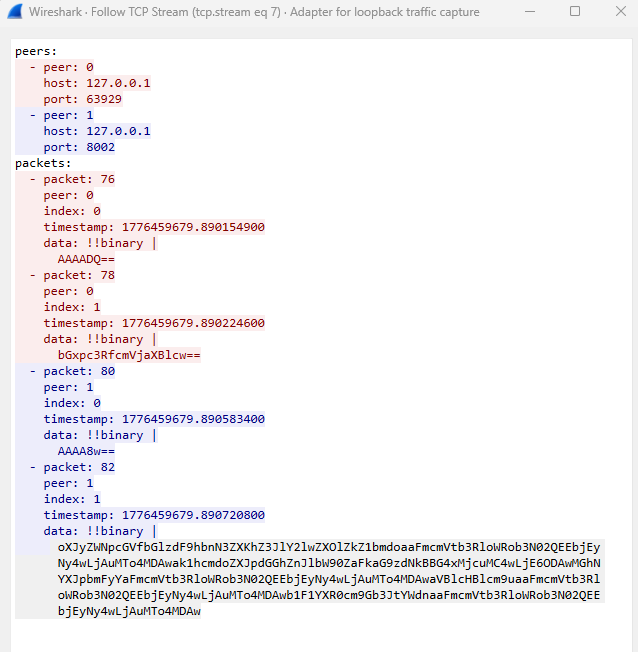

```json
     {
  "recipe_list_answer": {
    "recipes": {
      "Funghi": {
        "remote": {
          "host": {
            "value": "127.0.0.1:8000",
            "tag": 260
          }
        }
      },
      "Margherita": {
        "remote": {
          "host": {
            "value": "127.0.0.1:8000",
            "tag": 260
          }
        }
      },
      "Marinara": {
        "remote": {
          "host": {
            "value": "127.0.0.1:8000",
            "tag": 260
          }
        }
      },
      "Pepperoni": {
        "remote": {
          "host": {
            "value": "127.0.0.1:8000",
            "tag": 260
          }
        }
      },
      "QuattroFormaggi": {
        "remote": {
          "host": {
            "value": "127.0.0.1:8000",
            "tag": 260
          }
        }
      }
    }
  }
}
```

- Cette forme `remote.host` doit etre traitee comme equivalente a une disponibilite distante.
- La forme `local.missing_actions` reste presente pour les recettes locales.
- Sur UDP, `last_seen` (tag 1001) est observe sur le binaire de reference avec une map a cles entieres, notamment `1` et `-6`.
- Interpretation retenue sur les traces :
  - `1` porte la composante en secondes Unix.
  - `-6` porte la composante fractionnaire (sous-seconde).
  - Le timestamp est de la forme `secondes.fraction`.
- Dans les echanges heartbeat observes, le `Pong` reprend la valeur `last_seen` du `Ping` correspondant (echo de correlation).

- Fermeture de la session TCP

  - ```json
     58695 → 8000 [FIN, ACK]

    ```
  Le client envoie un message FIN, indiquant qu’il souhaite terminer la communication.
  Le serveur accuse réception, et la session TCP est ensuite fermée.


- Certaines trames observées correspondent uniquement à des accusés de réception TCP.
Ces paquets ne contiennent aucun payload applicatif et sont générés automatiquement
par la pile TCP afin de garantir
la fiabilité de la transmission.
```json
  58695 → 8000 [ACK]
```
Résumé:

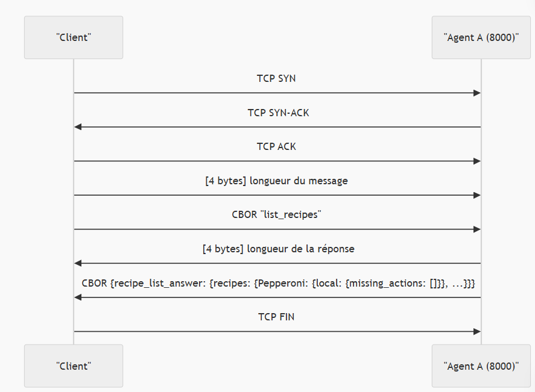

#### 2.2 Commande order Pepperoni
Lancement d'un client, qui se connecte au premier agent :
```bash
./pizza_factory client --peer 127.0.0.1:8002 order Pepperoni
```
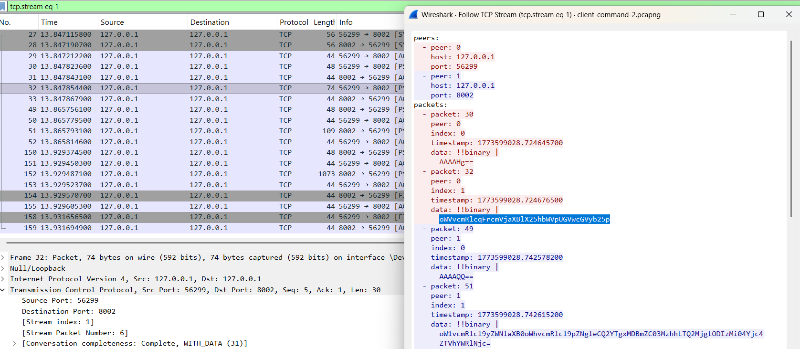
- Le client envoie une commande de type order pour la recette Pepperoni.
 ```json
  data: !!binary |
  oWVvcmRlcqFrcmVjaXBlX25hbWVpUGVwcGVyb25p
  ```
CBOR décodé:
```json
{
  "order": {
    "recipe_name": "Pepperoni"
  }
}
  ```
- Le serveur renvoie un accusé de réception avec un identifiant unique de commande.
 ```json
 data: !!binary |
oW1vcmRlcl9yZWNlaXB0oWhvcmRlcl9pZNgleCQ2YTgxMDBmZC03MzhhLTQ2MjgtODIzMi04Yjc4
ZTVhYWRlNjc=
  ```
CBOR décodé:
```json
{
  "order_receipt": {
    "order_id": {
      "tag": 37,
      "value": "6a8100fd-738a-4628-8232-8b78e5aade67"
    }
  }
}
  ```
- Une connexion TCP est établie vers l’agent 127.0.0.1:8000.
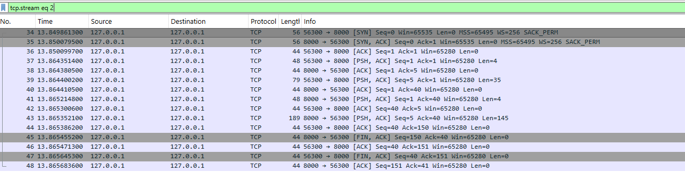


Lorsqu’un client envoie une commande Pepperoni à l’agent 127.0.0.1:8002, l’agent 127.0.0.1:8000 intervient de deux façons:
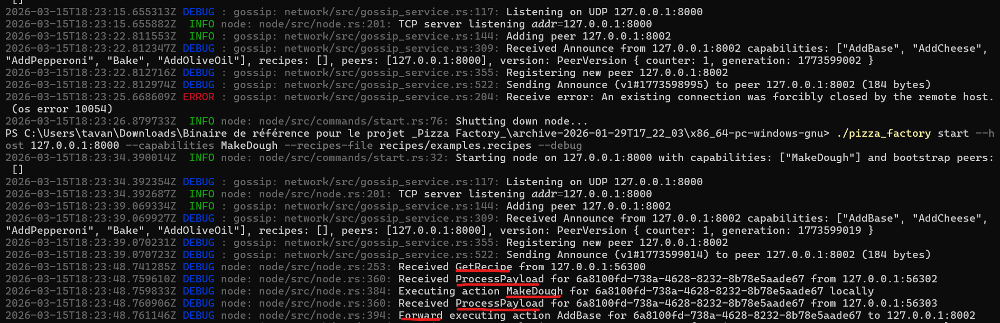
  - L’émetteur envoie d’abord un entier de longueur sur 4 octets, suivi d’un message CBOR get_recipe contenant le champ recipe_name = Pepperoni. L’agent 8000 répond avec un message CBOR recipe_answer contenant le champ recipe,
qui transporte la recette complète sous forme textuelle (l'agent 8000 répond à une requête GetRecipe)
    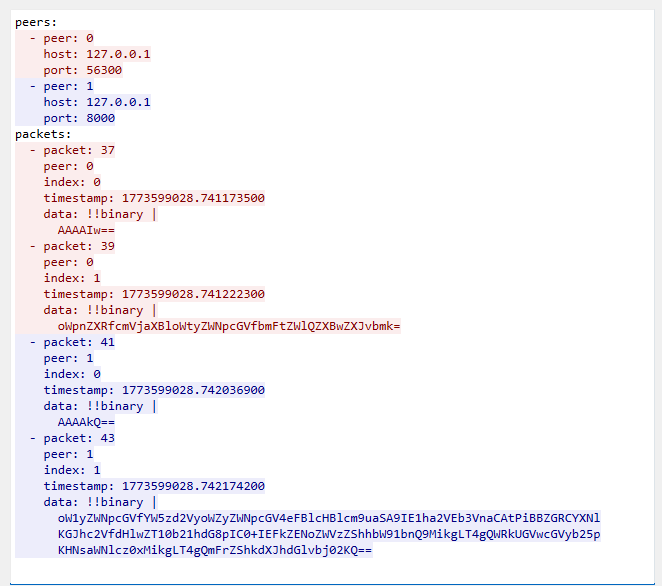
CBOR décodé de la requête :
```json
{
  "get_recipe": {
    "recipe_name": "Pepperoni"
  }
}
  ```
CBOR décodé de la réponse :
```json
{
  "recipe_answer": {
    "recipe": "Pepperoni = MakeDough -> AddBase(base_type=tomato) -> AddCheese(amount=2) -> AddPepperoni(slices=12) -> Bake(duration=6)"
  }
}
  ```
  - Ensuite, il reçoit un message ProcessPayload, exécute localement l’action MakeDough,
puis transmet la suite du traitement à 127.0.0.1:8002 pour l’action suivante AddBase.
Cela montre que l’exécution d’une commande peut être distribuée entre agents, avec transfert explicite du contexte d’exécution.
    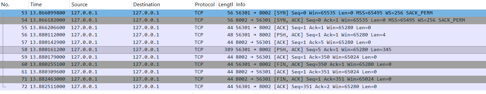
    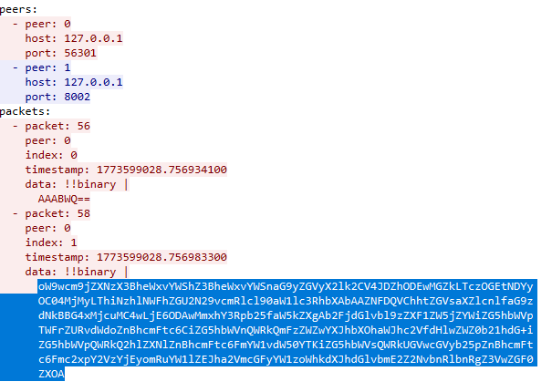

CBOR décodé de ProcessPayload 56301 -> 8002:
```json
{
  "process_payload": {
    "payload": {
      "order_id": {
        "tag": 37,
        "value": "6a8100fd-738a-4628-8232-8b78e5aade67"
      },
      "order_timestamp": 1773599028742680,
      "delivery_host": {
        "tag": 260,
        "value": "127.0.0.1:8002"
      },
      "action_index": 0,
      "action_sequence": [
        {
          "name": "MakeDough",
          "params": {}
        },
        {
          "name": "AddBase",
          "params": {
            "base_type": "tomato"
          }
        },
        {
          "name": "AddCheese",
          "params": {
            "amount": "2"
          }
        },
        {
          "name": "AddPepperoni",
          "params": {
            "slices": "12"
          }
        },
        {
          "name": "Bake",
          "params": {
            "duration": "6"
          }
        }
      ],
      "content": "",
      "updates": []
    }
  }
}
  ```
CBOR décodé de ProcessPayload 56302 -> 8000: ce stream sert à demander à 8000 d’exécuter la première étape.
L’historique updates indique déjà un Forward vers 8000
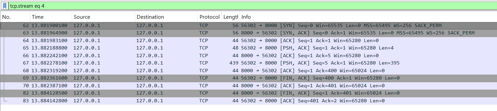
```json
{
  "process_payload": {
    "payload": {
      "order_id": {
        "tag": 37,
        "value": "6a8100fd-738a-4628-8232-8b78e5aade67"
      },
      "order_timestamp": 1773599028742680,
      "delivery_host": {
        "tag": 260,
        "value": "127.0.0.1:8002"
      },
      "action_index": 0,
      "action_sequence": [
        {
          "name": "MakeDough",
          "params": {}
        },
        {
          "name": "AddBase",
          "params": {
            "base_type": "tomato"
          }
        },
        {
          "name": "AddCheese",
          "params": {
            "amount": "2"
          }
        },
        {
          "name": "AddPepperoni",
          "params": {
            "slices": "12"
          }
        },
        {
          "name": "Bake",
          "params": {
            "duration": "6"
          }
        }
      ],
      "content": "",
      "updates": [
        {
          "Forward": {
            "to": {
              "tag": 260,
              "value": "127.0.0.1:8000"
            },
            "timestamp": 1773599028758515
          }
        }
      ]
    }
  }
}
  ```
CBOR décodé de ProcessPayload 56303 -> 8000: payload mis à jour après l’exécution de MakeDough. L’état a avancé : action_index passe de 0 à 1
;content contient maintenant Dough: ready; les updates enregistrent que MakeDough a été exécuté.
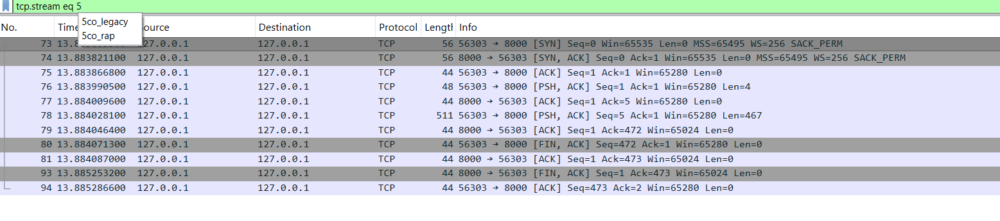
```json
{
  "process_payload": {
    "payload": {
      "action_index": 1,
      "content": "Dough: ready\n",
      "updates": [
        {
          "Forward": {
            "to": {
              "tag": 260,
              "value": "127.0.0.1:8000"
            },
            "timestamp": 1773599028758515
          }
        },
        {
          "Action": {
            "action": {
              "name": "MakeDough",
              "params": {}
            },
            "timestamp": 1773599028760016
          }
        }
      ]
    }
  }
}
  ```
CBOR décodé de ProcessPayload 56304 -> 8002: après avoir constaté que l’étape suivante est AddBase, 8000 forwarde donc le payload mis à jour vers 8002
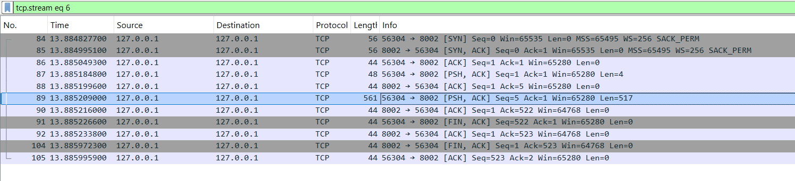
```json
{
  "process_payload": {
    "payload": {
      "action_index": 1,
      "content": "Dough: ready\n",
      "updates": [
        {
          "Forward": {
            "to": {
              "tag": 260,
              "value": "127.0.0.1:8000"
            },
            "timestamp": 1773599028758515
          }
        },
        {
          "Action": {
            "action": {
              "name": "MakeDough",
              "params": {}
            },
            "timestamp": 1773599028760016
          }
        },
        {
          "Forward": {
            "to": {
              "tag": 260,
              "value": "127.0.0.1:8002"
            },
            "timestamp": 1773599028761316
          }
        }
      ]
    }
  }
}
  ```
CBOR décodé de ProcessPayload 56305 -> 8002: 8002 exécute AddBase, met à jour content.
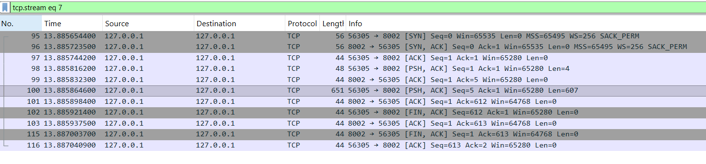
```json
{
  "process_payload": {
    "payload": {
      "content": "Dough + Base(tomato): ready\n",
      "updates": [
        {
          "Forward": {
            "to": {
              "tag": 260,
              "value": "127.0.0.1:8000"
            },
            "timestamp": 1773599028758515
          }
        },
        {
          "Action": {
            "action": {
              "name": "MakeDough",
              "params": {}
            },
            "timestamp": 1773599028760016
          }
        },
        {
          "Forward": {
            "to": {
              "tag": 260,
              "value": "127.0.0.1:8002"
            },
            "timestamp": 1773599028761316
          }
        },
        {
          "Action": {
            "action": {
              "name": "AddBase",
              "params": {
                "base_type": "tomato"
              }
            },
            "timestamp": 1773599028762356
          }
        }
      ]
    }
  }
}
  ```
8002 continue ainsi avec AddCheese:
```json
{
  "process_payload": {
    "payload": {
      "content": "Dough + Base(tomato): ready\nCheese x2\n",
      "updates": [
        {
          "Forward": {
            "to": {
              "tag": 260,
              "value": "127.0.0.1:8000"
            },
            "timestamp": 1773599028758515
          }
        },
        {
          "Action": {
            "action": {
              "name": "MakeDough",
              "params": {}
            },
            "timestamp": 1773599028760016
          }
        },
        {
          "Forward": {
            "to": {
              "tag": 260,
              "value": "127.0.0.1:8002"
            },
            "timestamp": 1773599028761316
          }
        },
        {
          "Action": {
            "action": {
              "name": "AddBase",
              "params": {
                "base_type": "tomato"
              }
            },
            "timestamp": 1773599028762356
          }
        },
        {
          "Action": {
            "action": {
              "name": "AddCheese",
              "params": {
                "amount": "2"
              }
            },
            "timestamp": 1773599028763201
          }
        }
      ]
    }
  }
}
```
et AddPepperonni + Bake.

- Quand le payload était complet, un message 'deliver' a été transféré à l'agent designé par 'delivery_host'. 
Ce message continent le payload de l'exécution finale et le contenu complet. 
- Pour voir quel agent responsable de l'envoi du message 'deliver', on a regardé les logs de CLI des 2 agents
dans le scénario où l'agent 8000 recevait la commande.
- Conclusion: l'agent qui termine le dernier étape est probablement responsable de l'envoi du message 'deliver'
à l'agent qui a reçu la commande du client. 

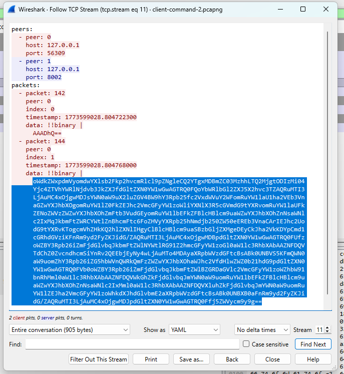

```json
{
  "deliver": {
    "payload": {
      "order_id": {
        "value": "6a8100fd-738a-4628-8232-8b78e5aade67",
        "tag": 37
      },
      "order_timestamp": "1773599028742680",
      "delivery_host": {
        "value": "127.0.0.1:8002",
        "tag": 260
      },
      "action_index": 5,
      "action_sequence": [
        {
          "name": "MakeDough",
          "params": {}
        },
        {
          "name": "AddBase",
          "params": {
            "base_type": "tomato"
          }
        },
        {
          "name": "AddCheese",
          "params": {
            "amount": "2"
          }
        },
        {
          "name": "AddPepperoni",
          "params": {
            "slices": "12"
          }
        },
        {
          "name": "Bake",
          "params": {
            "duration": "6"
          }
        }
      ],
      "content": "Dough + Base(tomato): ready\nCheese x2\nPepperoni slices x12\nBaked(6)\n",
      "updates": [
        {
          "Forward": {
            "to": {
              "value": "127.0.0.1:8000",
              "tag": 260
            },
            "timestamp": "1773599028758515"
          }
        },
        {
          "Action": {
            "action": {
              "name": "MakeDough",
              "params": {}
            },
            "timestamp": "1773599028760016"
          }
        },
        {
          "Forward": {
            "to": {
              "value": "127.0.0.1:8002",
              "tag": 260
            },
            "timestamp": "1773599028761316"
          }
        },
        {
          "Action": {
            "action": {
              "name": "AddBase",
              "params": {
                "base_type": "tomato"
              }
            },
            "timestamp": "1773599028762356"
          }
        },
        {
          "Action": {
            "action": {
              "name": "AddCheese",
              "params": {
                "amount": "2"
              }
            },
            "timestamp": "1773599028763201"
          }
        },
        {
          "Action": {
            "action": {
              "name": "AddPepperoni",
              "params": {
                "slices": "12"
              }
            },
            "timestamp": "1773599028764251"
          }
        },
        {
          "Action": {
            "action": {
              "name": "Bake",
              "params": {
                "duration": "6"
              }
            },
            "timestamp": "1773599028789713"
          }
        },
        {
          "Forward": {
            "to": {
              "value": "127.0.0.1:8002",
              "tag": 260
            },
            "timestamp": "1773599028803833"
          }
        }
      ]
    },
    "error": null
  }
}
```
- Réponse complète du serveur, de l'agent delivery_host au client: Le paquet 174 contient un objet CBOR de type completed_order, qui inclut le nom de la recette ainsi qu’un champ result. 
Ce champ semble contenir une chaîne JSON sérialisée décrivant le résultat final de la commande, notamment
  - l’identifiant,
  - le contenu produit,
  - les transferts entre nœuds qui font les mises à jour d’exécution (updates). L'analyse du champ "updates" permet d'affirmer que l'agent sur le port 8002 récupère d’abord la recette via un message TCP get_recipe envoyé à 127.0.0.1:8000,
    puis exécute le traitement sous forme d’étapes successives transportées par des messages process_payload. Les messages observés montrent une progression de action_index et un enrichissement progressif de content et updates,
    ce qui indique une délégation de certaines actions à l’agent distant avant reprise du traitement local.
  - la livraison finale.

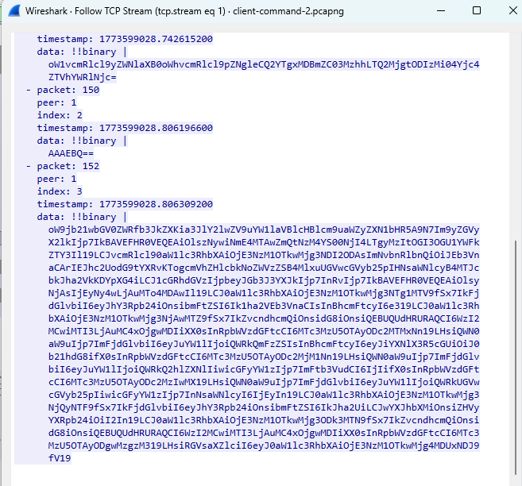
  

CBOR décodé:
```json
{
  "completed_order": {
    "recipe_name": "Pepperoni",
    "result": "{\"order_id\":{\"@@TAGGED@@\":[37,\"4547c028-34e7-4f00-97db-93a28f86fc6d\"]}, ... }"
  }
}
  ```

L’objet dans "result" contient quatre grandes parties :
```json
{
  "content": "...",
  "order_id": ...,
  "order_timestamp": ...,
  "updates": [ ... ]
}
  ```
```json
{
  "order_id": {
    "@@TAGGED@@": [37, "4547c028-34e7-4f00-97db-93a28f86fc6d"]
  },
  "order_timestamp": 1773512862252857,
  "content": "Dough + Base(tomato): ready\nCheese x2\nPepperoni slices x12\nBaked(6)\n",
  "updates": [
    {
      "Forward": {
        "to": {
          "@@TAGGED@@": [260, "127.0.0.1:8000"]
        },
        "timestamp": 1773512862253448
      }
    },
    {
      "Action": {
        "action": {
          "name": "MakeDough",
          "params": {}
        },
        "timestamp": 1773512862254178
      }
    },
    {
      "Forward": {
        "to": {
          "@@TAGGED@@": [260, "127.0.0.1:8002"]
        },
        "timestamp": 1773512862254919
      }
    },
    {
      "Action": {
        "action": {
          "name": "AddBase",
          "params": {
            "base_type": "tomato"
          }
        },
        "timestamp": 1773512862268636
      }
    },
    {
      "Action": {
        "action": {
          "name": "AddCheese",
          "params": {
            "amount": "2"
          }
        },
        "timestamp": 1773512862284697
      }
    },
    {
      "Action": {
        "action": {
          "name": "AddPepperoni",
          "params": {
            "slices": "12"
          }
        },
        "timestamp": 1773512862300510
      }
    },
    {
      "Action": {
        "action": {
          "name": "Bake",
          "params": {
            "duration": "6"
          }
        },
        "timestamp": 1773512862302050
      }
    },
    {
      "Forward": {
        "to": {
          "@@TAGGED@@": [260, "127.0.0.1:8002"]
        },
        "timestamp": 1773512862303197
      }
    },
    {
      "Deliver": {
        "timestamp": 1773512862303923
      }
    }
  ]
}
  ```
Résumé:

client → 8002 : order("Pepperoni")

8002 → client : order_receipt(order_id)

8002 → 8000 : get_recipe("Pepperoni")

8000 → 8002 : recipe_answer(recipe=...)

8002 construit le process_payload initial

8002 → 8000 : délégation de MakeDough

8000 → 8002 : retour d’un process_payload mis à jour

8002 continue AddBase, AddCheese, AddPepperoni, Bake
8002 → 8002 : deliver - car il est l'agent exécutant le dernier étape et l'agent recevant la commande du client.
8002 → client : completed_order(...)

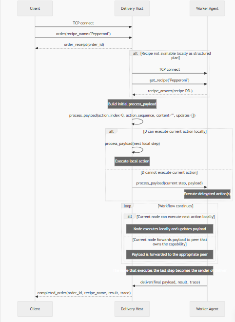

#### Traitement d'erreur
1. Quand un client essaie de commander une pizza qui n'est pas dans la liste des recettes:
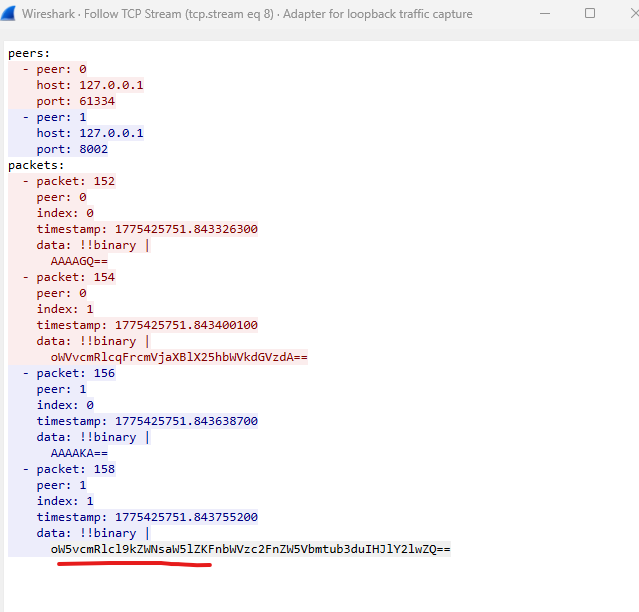

Requête client décodée:
```json
{
  "order": {
    "recipe_name": "test"
  }
}
```


Réponse du serveur décodée:
```json
{
  "order_declined": {
    "message": "Unknown recipe"
  }
}
  ```

2. Quand un client essaie de commander une pizza dont une étape n'est couverte par aucun agent:

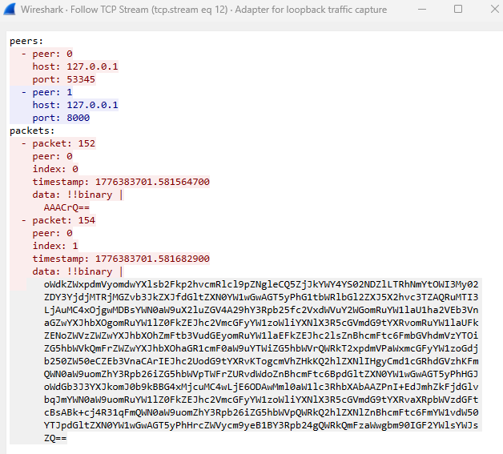
- L'agent qui exécute la dernière étape connue par le réseau des agents, met à jour deliver message 
avec l'erreur. Il envoie ce deliver message à l'agent delivery host. 
```json
{
  "deliver": {
    "payload": {
      "order_id": {
        "value": "9f2daf8a-646e-4a6f-9b73-6d67b7c14c0f",
        "tag": 37
      },
      "order_timestamp": "1776383701577069",
      "delivery_host": {
        "value": "127.0.0.1:8000",
        "tag": 260
      },
      "action_index": 3,
      "action_sequence": [
        {
          "name": "MakeDough",
          "params": {}
        },
        {
          "name": "AddBase",
          "params": {
            "base_type": "tomato"
          }
        },
        {
          "name": "AddCheese",
          "params": {
            "amount": "2"
          }
        },
        {
          "name": "AddBasil",
          "params": {
            "leaves": "3"
          }
        },
        {
          "name": "Bake",
          "params": {
            "duration": "5"
          }
        },
        {
          "name": "AddOliveOil",
          "params": {}
        }
      ],
      "content": "Dough + Base(tomato): ready\nCheese x2\n",
      "updates": [
        {
          "Action": {
            "action": {
              "name": "MakeDough",
              "params": {}
            },
            "timestamp": "1776383701578121"
          }
        },
        {
          "Forward": {
            "to": {
              "value": "127.0.0.1:8002",
              "tag": 260
            },
            "timestamp": "1776383701578905"
          }
        },
        {
          "Action": {
            "action": {
              "name": "AddBase",
              "params": {
                "base_type": "tomato"
              }
            },
            "timestamp": "1776383701579734"
          }
        },
        {
          "Action": {
            "action": {
              "name": "AddCheese",
              "params": {
                "amount": "2"
              }
            },
            "timestamp": "1776383701580508"
          }
        }
      ]
    },
    "error": "Action AddBasil not available"
  }
}
```
- Le client reçoit order receipt et un message d'échec:

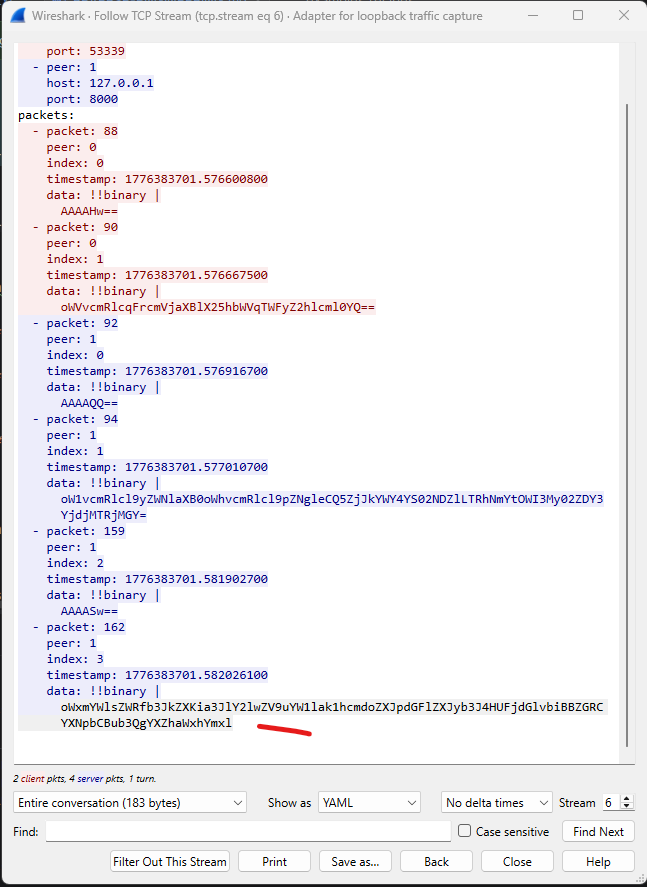

```json
{
  "failed_order": {
    "recipe_name": "Margherita",
    "error": "Action AddBasil not available"
  }
}
  ```
## Spécification du protocole observé

L’analyse des captures réseau montre que le système repose sur une architecture distribuée de type peer-to-peer, utilisant deux mécanismes complémentaires :

- **UDP** pour la découverte et la propagation d’informations entre nœuds (protocole de type Gossip).

- **TCP** pour l’exécution de commandes et les transferts de données nécessitant de la fiabilité.

Le fonctionnement global du protocole peut être séparé en deux phases principales.
### Phase 1 : Découverte et diffusion (UDP)

La première phase du protocole repose sur un mécanisme de découverte de nœuds utilisant le protocole UDP.

Chaque nœud du réseau diffuse périodiquement des messages afin d’informer les autres nœuds de son adresse réseau, ses capacités, la liste de pairs connus


Ces messages correspondent à un mécanisme de type Gossip (ou protocole épidémique):
- Chaque nœud communique avec un nombre limité de voisins.

- Les informations connues sont échangées et propagées progressivement. Aucune autorité centrale n’est nécessaire

Ce mécanisme permet :

- une propagation rapide de l’information

- une tolérance aux pannes

- une découverte dynamique des pairs

Les messages observés dans cette phase comprennent notamment :

1. Announce : annonce la présence d’un nœud et ses caractéristiques. Champs typiques :

- node_addr : adresse du nœud

- capabilities : liste des fonctionnalités supportées

- peers : liste des pairs connus

- version

- generation

2. Ping / Pong : Messages de heartbeat permettant de vérifier que les pairs sont toujours actifs.
Ces messages servent à maintenir une vision cohérente du réseau.

UDP permet une connexion rapide, continuelle, et tolérant quelques pertes de données. Les noeuds se découvrent et propagent des informations
de manière rapide avec ce protocole.

La liste des pairs est progressivement enrichie. Un noeud peut choisir le pair apte à exécuter un service.
Il établit une connexion TCP vers le pair approprié, qui devient le service applicatif endpoint.

### Phase 2 : Exécution des commandes (TCP)
Après la phase de découverte, les opérations applicatives utilisent TCP.

Contrairement à UDP, TCP fournit : une livraison fiable, un ordre garanti des messages, une gestion des retransmissions

Ces propriétés sont nécessaires pour les opérations applicatives plus importantes. (passer une commande de pizza)

1. Établissement de la connexion

La communication commence par un handshake TCP classique en trois étapes :

- SYN

- SYN-ACK

- ACK

Une fois la connexion établie, un canal fiable est disponible entre les deux nœuds.

2. Échange de commandes
- le client envoie une commande

- le serveur traite la requête

- le serveur renvoie une réponse ou des données

Les messages peuvent contenir :

- des commandes applicatives

- des résultats de traitement

- des transferts de données plus volumineux

Cette phase correspond à la production ou exécution effective des tâches du système: fournir la liste des recettes, passer une commande de pizza.

## Format des données des requêtes

 Les données échangées sont **sérialisées en CBOR** (*Concise Binary Object Representation*) avant d’être envoyées sur le réseau.

    - **Binaire et compact** : les objets applicatifs sont encodés en binaire, ce qui réduit la taille des paquets par rapport à un JSON texte.
    - **Efficace** : l’encodage/décodage est rapide, ce qui limite la surcharge côté client et côté serveur.
    - **Typé** : CBOR gère nativement des types riches (entiers, chaînes, tableaux, objets, tags, etc.), ce qui permet de préserver la structure des messages.

Concrètement, au lieu d’envoyer un corps de requête en JSON (`{"clé": "valeur"}`), chaque agent envoie l’équivalent **encodé en CBOR**.
Les extraits JSON ci‑dessous sont donc une **représentation lisible** de la charge utile CBOR décodée (par exemple via Wireshark), pas le contenu exact transporté sur le fil.

