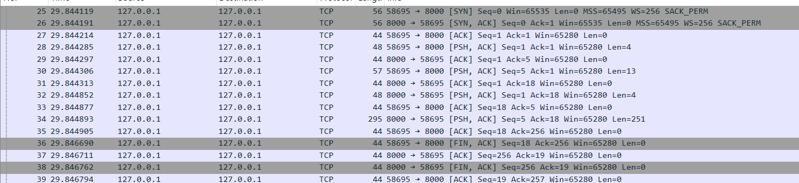
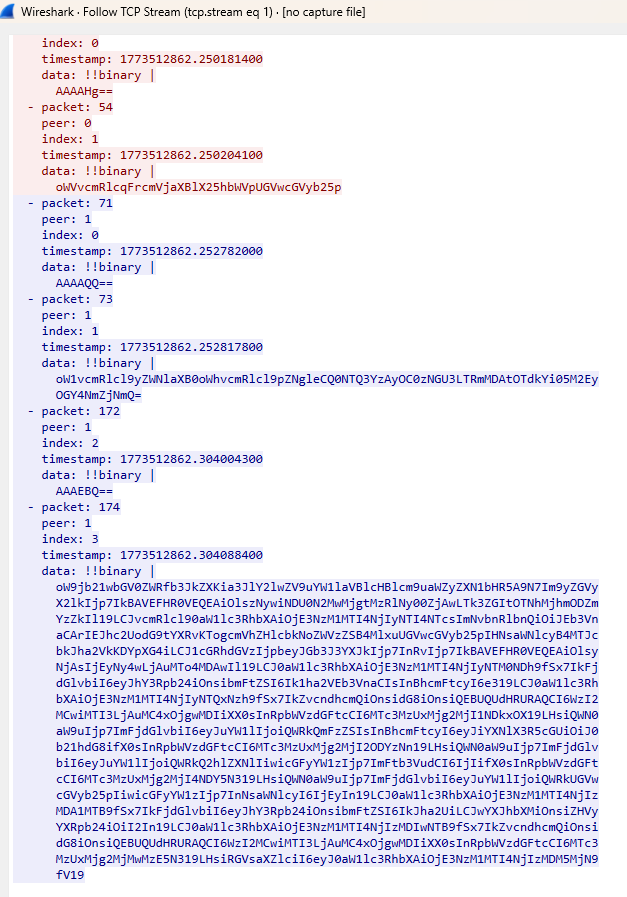

## Exemple : lancement d'une chaîne de 2 nœuds

Dans cet exemple, nous démarrons une chaîne minimale de deux agents qui vont :

1. S’annoncer mutuellement (messages `Announce`).
2. Se découvrir et échanger leurs capacités/recettes.
3. Se surveiller en continu via des messages `Ping` / `Pong`.

### 1. Démarrage des deux agents

Lancement du premier agent (nœud A) :
```bash
./pizza_factory start --host 127.0.0.1:8000 --capabilities MakeDough --recipes-file recipes/examples.recipes --debug
```

Lancement du deuxième agent (nœud B), qui se connecte au premier :
```bash
./pizza_factory start --host 127.0.0.1:8002 --capabilities AddBase,AddCheese,AddPepperoni,Bake,AddOliveOil --peer 127.0.0.1:8000 --debug
```

Chaque agent écoute sur un port UDP différent (`8000` et `8002`) et échange des paquets contenant des messages CBOR.

### 2. Observation des paquets dans Wireshark

Voici les en‑têtes des paquets échangés entre les deux agents, vus dans Wireshark, avec la charge utile décodée (la partie JSON est une **vue décodée du CBOR**).


La capture réseau complète utilisée pour cet exemple est disponible dans le dépôt :

- [`starting-peer-annouced.pcap`](./doc/pcap/starting-peer-annouced.pcap)

#### Annonce initiale du nœud A vers le nœud B

```bash
3	1.176352	127.0.0.1	127.0.0.1	UDP	201	8002 → 8000 Len=169
```
```json
{
    "Announce": {
        "node_addr": {
            "tag": 260,
            "value": "127.0.0.1:8000"
        },
        "capabilities": [
            "MakeDough"
        ],
        "recipes": [
            "QuattroFormaggi",
            "Pepperoni",
            "Funghi",
            "Margherita",
            "Marinara"
        ],
        "peers": [
            {
                "tag": 260,
                "value": "127.0.0.1:8002"
            }
        ],
        "version": {
            "counter": 3,
            "generation": 1772191739
        }
    }
}
```

Par la suite le premier agent a répondu à l'annonce du deuxième agent en envoyant une annonce à son tour, avec les capacités et les recettes qu'il peut faire, ainsi que les pairs auxquels il est connecté avec un tag

```bash
4	1.176511	127.0.0.1	127.0.0.1	UDP	216	8000 → 8002 Len=184
```
```json
{
    "Announce": {
        "node_addr": {
            "tag": 260,
            "value": "127.0.0.1:8002"
        },
        "capabilities": [
            "AddBase",
            "AddCheese",
            "AddPepperoni",
            "Bake",
            "AddOliveOil"
        ],
        "recipes": [],
        "peers": [
            {
                "tag": 260,
                "value": "127.0.0.1:8000"
            }
        ],
        "version": {
            "counter": 1,
            "generation": 1772192016
        }
    }
}
```

Le deuxième agent a ensuite envoyé un ping au premier agent pour vérifier sa disponibilité, et le premier agent a répondu avec un pong, tous les deux avec un tag
```bash
7	3.177938	127.0.0.1	127.0.0.1	UDP	99	8002 → 8000 Len=67
```
```json
{
    "Ping": {
        "last_seen": {
            "tag": 1001,
            "value": {}
        },
        "version": {
            "counter": 3,
            "generation": 1772191739
        }
    }
}
```

Le premier agent a ensuite répondu au ping du deuxième agent avec un pong, tous les deux avec un tag
```bash
8	3.178069	127.0.0.1	127.0.0.1	UDP	99	8000 → 8002 Len=67
```
```json
{
    "Pong": {
        "last_seen": {
            "tag": 1001,
            "value": {}
        },
        "version": {
            "counter": 3,
            "generation": 1772191739
        }
    }
}
```

Et ici les rôles sont inversés, le premier agent a envoyé un ping au deuxième agent pour vérifier sa disponibilité, et le deuxième agent a répondu avec un pong.
```bash
11	4.148875	127.0.0.1	127.0.0.1	UDP	99	8000 → 8002 Len=67
```
```json
{
    "Ping": {
        "last_seen": {
            "tag": 1001,
            "value": {}
        },
        "version": {
            "counter": 1,
            "generation": 1772192016
        }
    }
}
```

Pareil le deuxième répond et lui renvoie un ping ainsi de suite afin de garantir une disponibilité constante entre les deux agents.
```bash
12	4.149029	127.0.0.1	127.0.0.1	UDP	99	8002 → 8000 Len=67
```
```json
{
    "Pong": {
        "last_seen": {
            "tag": 1001,
            "value": {}
        },
        "version": {
            "counter": 1,
            "generation": 1772192016
        }
    }
}
```
#### 2.1 Commande list-recipes
Lancement d'un client, qui se connecte au premier agent :
```bash
./pizza_factory client --peer 127.0.0.1:8000 list-recipes
```


Lorsqu’un client se connecte au service TCP sur le port 8000, le système d’exploitation attribue automatiquement un port éphémère côté client (par exemple 58695).
Ce port identifie la session TCP et permet au serveur de gérer plusieurs connexions simultanées.

- Établissement de la connexion TCP

  - ```json
    25 58695 → 8000  [SYN]
  
    26 8000  → 58695 [SYN, ACK]

    27 58695 → 8000  [ACK]
    ```
    Il s’agit du handshake TCP classique en trois étapes (three-way handshake), utilisé pour établir une connexion fiable entre deux machines.
    
    Le client utilise l’adresse 127.0.0.1 avec un port éphémère 58695. Le serveur écoute sur l’adresse 127.0.0.1 au port 8000

- Première commande TCP
 
  - ```json
    58695 → 8000  [PSH, ACK] Len=4
    
    data: !!binary |
    AAAADQ==
    ```
    Cela annonce la taille du message suivant : 4 octets.
    Après décodage Base64 : 00 00 00 0D


- Envoi du payload de la commande

  - ```json
      58695 → 8000 [PSH, ACK] Len=13
      data: !!binary |
      bGxpc3RfcmVjaXBlcw==
      ```
    Après décodage CBOR : "list_recipes". Cette chaîne correspond directement à la commande envoyée par le client


- Réponse du serveur sur la taille de la réponse 

  - ```json
     8000 → 58695 [PSH, ACK] Len=4
    ```
    La réponse suivante fera 251 octets.

 
- Transfert de données plus important: payload de la réponse

  - ```json
     8000 → 58695  Len=251
     data: !!binary |
      oXJyZWNpcGVfbGlzdF9hbnN3ZXKhZ3JlY2lwZXOlZkZ1bmdoaaFlbG9jYWyhb21pc3NpbmdfYWN0aW9uc4FsQWRkTXVzaHJvb21zak1hcmdoZXJpdGGhZWxvY2FsoW9taXNzaW5nX2FjdGlvbnOBaEFkZEJhc2lsaE1hcmluYXJhoWVsb2NhbKFvbWlzc2luZ19hY3Rpb25zgmlBZGRHYXJsaWNqQWRkT3JlZ2Fub2lQZXBwZXJvbmmhZWxvY2FsoW9taXNzaW5nX2FjdGlvbnOAb1F1YXR0cm9Gb3JtYWdnaaFlbG9jYWyhb21pc3NpbmdfYWN0aW9uc4A=
    ```
  Le serveur envoie ici 251 octets au client.
  Ces données sont encodées sous forme binaire structurée. La réponse après décodage CBOR : 

```
{
    "recipe_list_answer": {
        "recipes": {
            "Funghi": {
                "local": {
                    "missing_actions": [
                        "AddMushrooms"
                    ]
                }
            },
            "Margherita": {
                "local": {
                    "missing_actions": [
                        "AddBasil"
                    ]
                }
            },
            "Marinara": {
                "local": {
                    "missing_actions": [
                        "AddGarlic",
                        "AddOregano"
                    ]
                }
            },
            "Pepperoni": {
                "local": {
                    "missing_actions": []
                }
            },
            "QuattroFormaggi": {
                "local": {
                    "missing_actions": []
                }
            }
        }
    }
}
```

- Fermeture de la session TCP

  - ```json
     58695 → 8000 [FIN, ACK]
    
    ```
  Le client envoie un message FIN, indiquant qu’il souhaite terminer la communication. 
  Le serveur accuse réception, et la session TCP est ensuite fermée.


- Certaines trames observées correspondent uniquement à des accusés de réception TCP. 
Ces paquets ne contiennent aucun payload applicatif et sont générés automatiquement 
par la pile TCP afin de garantir 
la fiabilité de la transmission. 
```json
  58695 → 8000 [ACK]
```
#### 2.2 Commande order Pepperoni
Lancement d'un client, qui se connecte au premier agent :
```bash
./pizza_factory client --peer 127.0.0.1:8002 order Pepperoni
```


- Le client envoie une commande de type order pour la recette Pepperoni.
 ```json
  data: !!binary |
  oWVvcmRlcqFrcmVjaXBlX25hbWVpUGVwcGVyb25p
  ```
CBOR décodé: 
```json
{
  "order": {
    "recipe_name": "Pepperoni"
  }
}
  ```
- Le serveur renvoie un accusé de réception avec un identifiant unique de commande.
 ```json
 data: !!binary |
oW1vcmRlcl9yZWNlaXB0oWhvcmRlcl9pZNgleCQ0NTQ3YzAyOC0zNGU3LTRmMDAtOTdkYi05M2Ey
OGY4NmZjNmQ=
  ```
CBOR décodé:
```json
{
  "order_receipt": {
    "order_id": {
      "tag": 37,
      "value": "4547c028-34e7-4f00-97db-93a28f86fc6d"
    }
  }
}
  ```
- Réponse complète du serveur: Le paquet 174 contient un objet CBOR de type completed_order, qui inclut le nom de la recette ainsi qu’un champ result. Ce champ semble contenir une chaîne JSON sérialisée décrivant le résultat final de la commande, notamment l’identifiant, le contenu produit, les mises à jour d’exécution, 
les transferts entre nœuds et la livraison finale.
  CBOR décodé:
```json
{
  "completed_order": {
    "recipe_name": "Pepperoni",
    "result": "{\"order_id\":{\"@@TAGGED@@\":[37,\"4547c028-34e7-4f00-97db-93a28f86fc6d\"]}, ... }"
  }
}
  ```
JSON contenu dans result. Il ne décrit pas seulement la pizza finale. 
Il raconte aussi le déroulé de traitement de la commande.

L’objet contient quatre grandes parties :
```json
{
  "content": "...",
  "order_id": ...,
  "order_timestamp": ...,
  "updates": [ ... ]
}
  ```
```json
{
  "order_id": {
    "@@TAGGED@@": [37, "4547c028-34e7-4f00-97db-93a28f86fc6d"]
  },
  "order_timestamp": 1773512862252857,
  "content": "Dough + Base(tomato): ready\nCheese x2\nPepperoni slices x12\nBaked(6)\n",
  "updates": [
    {
      "Forward": {
        "to": {
          "@@TAGGED@@": [260, "127.0.0.1:8000"]
        },
        "timestamp": 1773512862253448
      }
    },
    {
      "Action": {
        "action": {
          "name": "MakeDough",
          "params": {}
        },
        "timestamp": 1773512862254178
      }
    },
    {
      "Forward": {
        "to": {
          "@@TAGGED@@": [260, "127.0.0.1:8002"]
        },
        "timestamp": 1773512862254919
      }
    },
    {
      "Action": {
        "action": {
          "name": "AddBase",
          "params": {
            "base_type": "tomato"
          }
        },
        "timestamp": 1773512862268636
      }
    },
    {
      "Action": {
        "action": {
          "name": "AddCheese",
          "params": {
            "amount": "2"
          }
        },
        "timestamp": 1773512862284697
      }
    },
    {
      "Action": {
        "action": {
          "name": "AddPepperoni",
          "params": {
            "slices": "12"
          }
        },
        "timestamp": 1773512862300510
      }
    },
    {
      "Action": {
        "action": {
          "name": "Bake",
          "params": {
            "duration": "6"
          }
        },
        "timestamp": 1773512862302050
      }
    },
    {
      "Forward": {
        "to": {
          "@@TAGGED@@": [260, "127.0.0.1:8002"]
        },
        "timestamp": 1773512862303197
      }
    },
    {
      "Deliver": {
        "timestamp": 1773512862303923
      }
    }
  ]
}
  ```

## Spécification du protocole observé

L’analyse des captures réseau montre que le système repose sur une architecture distribuée de type peer-to-peer, utilisant deux mécanismes complémentaires :

- **UDP** pour la découverte et la propagation d’informations entre nœuds (protocole de type Gossip).

- **TCP** pour l’exécution de commandes et les transferts de données nécessitant de la fiabilité.

Le fonctionnement global du protocole peut être séparé en deux phases principales.
### Phase 1 : Découverte et diffusion (UDP)

La première phase du protocole repose sur un mécanisme de découverte de nœuds utilisant le protocole UDP.

Chaque nœud du réseau diffuse périodiquement des messages afin d’informer les autres nœuds de son adresse réseau, ses capacités, la liste de pairs connus


Ces messages correspondent à un mécanisme de type Gossip (ou protocole épidémique): 
- Chaque nœud communique avec un nombre limité de voisins.

- Les informations connues sont échangées et propagées progressivement. Aucune autorité centrale n’est nécessaire

Ce mécanisme permet :

- une propagation rapide de l’information

- une tolérance aux pannes

- une découverte dynamique des pairs

Les messages observés dans cette phase comprennent notamment :

1. Announce : annonce la présence d’un nœud et ses caractéristiques. Champs typiques :

- node_addr : adresse du nœud

- capabilities : liste des fonctionnalités supportées

- peers : liste des pairs connus

- version

- generation

2. Ping / Pong : Messages de heartbeat permettant de vérifier que les pairs sont toujours actifs. 
Ces messages servent à maintenir une vision cohérente du réseau.

UDP permet une connexion rapide, continuelle, et tolérant quelques pertes de données. Les noeuds se découvrent et propagent des informations
de manière rapide avec ce protocole.

La liste des pairs est progressivement enrichie. Un noeud peut choisir le pair apte à exécuter un service.  
Il établit une connexion TCP vers le pair approprié, qui devient le service applicatif endpoint.

### Phase 2 : Exécution des commandes (TCP)
Après la phase de découverte, les opérations applicatives utilisent TCP.

Contrairement à UDP, TCP fournit : une livraison fiable, un ordre garanti des messages, une gestion des retransmissions

Ces propriétés sont nécessaires pour les opérations applicatives plus importantes. (passer une commande de pizza)

1. Établissement de la connexion

La communication commence par un handshake TCP classique en trois étapes :

- SYN

- SYN-ACK

- ACK

Une fois la connexion établie, un canal fiable est disponible entre les deux nœuds.

2. Échange de commandes
- le client envoie une commande

- le serveur traite la requête

- le serveur renvoie une réponse ou des données

Les messages peuvent contenir :

- des commandes applicatives

- des résultats de traitement

- des transferts de données plus volumineux

Cette phase correspond à la production ou exécution effective des tâches du système: fournir la liste des recettes, passer une commande de pizza.

## Format des données des requêtes

 Les données échangées sont **sérialisées en CBOR** (*Concise Binary Object Representation*) avant d’être envoyées sur le réseau.

    - **Binaire et compact** : les objets applicatifs sont encodés en binaire, ce qui réduit la taille des paquets par rapport à un JSON texte.
    - **Efficace** : l’encodage/décodage est rapide, ce qui limite la surcharge côté client et côté serveur.
    - **Typé** : CBOR gère nativement des types riches (entiers, chaînes, tableaux, objets, tags, etc.), ce qui permet de préserver la structure des messages.

Concrètement, au lieu d’envoyer un corps de requête en JSON (`{"clé": "valeur"}`), chaque agent envoie l’équivalent **encodé en CBOR**.  
Les extraits JSON ci‑dessous sont donc une **représentation lisible** de la charge utile CBOR décodée (par exemple via Wireshark), pas le contenu exact transporté sur le fil.

